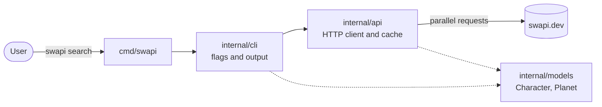

<div align="center">

# SWAPI CLI Search Tool

Search Star Wars characters and their homeworlds from the terminal, powered by the [Star Wars API](https://swapi.dev).


</div>

---

This project began as a Python script and was re-engineered in Go. The Go version in [`Go/`](Go) is the maintained tool. The original Python prototype is kept in [`Python_old_Version/`](Python_old_Version) for comparison.

## Contents

- [Highlights](#highlights)
- [Quick start](#quick-start)
- [Usage](#usage)
- [Why Go over Python](#why-go-over-python)
- [Architecture](#architecture)
- [Development](#development)
- [Project history](#project-history)

## Highlights

- **One file to install.** A 6.4 MB static binary with no runtime and no third-party packages.
- **Complete results.** Returns every matching character across all result pages, not just the first.
- **Fast.** Result pages and homeworlds are fetched in parallel, and repeated requests are served from an in-memory cache.
- **Predictable.** Typed data, explicit errors and documented exit codes, so it works well in scripts.
- **Tested.** Offline unit tests run with the race detector and cover 97% of statements.

## Quick start

Requires [Go 1.25 or newer](https://go.dev/dl/).

```bash
go install github.com/jkapsalis/SwAPI-cli-search-tool/Go/cmd/swapi@latest
swapi search "luke sky" --world
```

To build from source instead:

```bash
git clone https://github.com/jkapsalis/SwAPI-cli-search-tool.git
cd SwAPI-cli-search-tool/Go
make build
./bin/swapi search "luke sky" --world
```

## Usage

```text
swapi search <name> [--world]
```

| Argument | Description |
|---|---|
| `<name>` | Full or partial character name. Quote names that contain spaces. |
| `--world` | Also show each character's homeworld and compare its day and year length to Earth's. Works before or after the name. |

```text
$ swapi search "luke sky" --world
Name: Luke Skywalker
Height: 172 cm
Mass: 77 kg
Birth Year: 19BBY

Homeworld: Tatooine
Population: 200000
Rotation Period: 23 hours
Orbital Period: 304 days

Day vs Earth: 0.96x
Year vs Earth: 0.83x
```

A partial name returns every match. For example, `swapi search sky` lists Luke, Anakin and Shmi Skywalker.

| Exit code | Meaning |
|---|---|
| `0` | Success |
| `1` | Character not found, or the API returned an error |
| `2` | Invalid input: unknown command, missing name or unknown flag |

## Why Go over Python

The Python version was a good prototype. It was quick to write and easy to read. But turning it into a tool other people can install and depend on showed its limits. Go was chosen because it solves each of those limits with its standard toolchain alone.

### At a glance

| | Python (original) | Go (current) |
|---|---|---|
| **What users install** | Python interpreter, then `pip install -r requirements.txt` | One binary |
| **Third-party packages** | 16 pinned, of which only `requests` is used | None, standard library only |
| **Search results** | First match on the first page | Every match on every page |
| **HTTP requests** | One at a time, new connection each time | In parallel, connections reused, results cached |
| **Data model** | Dictionaries; a typo in a key fails at runtime | Typed structs; a typo fails at compile time |
| **Errors** | Generic `Exception`, bare `except`, Python traceback on failure | Typed errors, clear messages, exit codes |
| **Tests** | None | 32 test cases, race detector, 97% coverage |
| **Platforms** | Anywhere Python is installed | Cross-compiled for Linux, macOS and Windows |

### Measured

Both versions were run on the same machine against the live API.

| Metric | Python | Go | Difference |
|---|---:|---:|---|
| Startup time (`--help`, median of 30 runs) | 102 ms | 4.6 ms | Go is about 22× faster |
| One character with homeworld (`search "luke sky" --world`, median of 10) | 543 ms | 262 ms | Go is about 2× faster |
| Install size on top of the OS | Python + 150 MB of packages | 6.4 MB binary | Go is at least 23× smaller |
| All 58 matches for `a`, with 34 homeworlds | Not supported | 502 ms | Only Go can do this |

The Go tool fetches 6 result pages and 34 homeworlds in about the time the Python version takes to fetch a single character. The gains come from three things: no interpreter start-up, reusing one HTTPS connection instead of opening a new one per request, and running independent requests in parallel.

<sub>Measured on 2026-10-04 on Linux x86-64 (WSL2) with Python 3.12.3 and Go 1.27.1. The Python package size is a fresh virtual environment built from `requirements.txt`, minus an empty one; with `requests` alone it is about 3 MB. Network timings depend on your connection and on swapi.dev.</sub>

### In the code

**Fetching data.** Python stops at the first match and makes each request in turn:

```python
results = search_character(args.name)    # first page of results only
char = results[0]                        # first match only
world = get_resource(char["homeworld"])  # one request at a time
```

Go fetches the remaining result pages at the same time, then fetches all homeworlds the same way:

```go
for p := 2; p <= pages; p++ {
    wg.Go(func() {
        page, err := c.searchPage(ctx, name, p)
        results[p-1], errs[p-1] = page.Results, err
    })
}
wg.Wait()
```

**Handling errors.** Python raises a generic exception, which ends in a traceback:

```python
if response.status_code != 200:
    raise Exception("Failed to fetch character")
```

Go returns a typed error that the CLI turns into a clear message and exit code:

```go
if resp.StatusCode != http.StatusOK {
    return nil, &StatusError{URL: u, StatusCode: resp.StatusCode}
}
```

### Why these properties matter

1. **Distribution.** Users download one file and run it. There is no interpreter version to match and no virtual environment to manage.
2. **Concurrency.** Goroutines and `sync.WaitGroup` make parallel requests short and safe, and the race detector checks them in every test run.
3. **Type safety.** JSON is decoded into `Character` and `Planet` structs, so the compiler catches mistakes that Python only finds when that line runs.
4. **Explicit errors.** Every failure is a returned value that has to be handled, which leads to precise messages instead of stack traces.
5. **Built-in tooling.** Formatting, static checks, testing, coverage and cross-compilation all ship with Go. No extra tools to install.

### Trade-offs

Go is not free. The Go version is about 360 lines against Python's 89, because Go is more explicit and the Go version does more: pagination, concurrency, caching and error types. Python is still faster for quick experiments and data work. For a small, distributable command-line tool, Go is the better fit.

## Architecture



| Path | Responsibility |
|---|---|
| `Go/cmd/swapi` | Entry point. Creates the API client and runs the CLI. |
| `Go/internal/cli` | Parses arguments, validates input, formats output and sets exit codes. |
| `Go/internal/api` | Calls SWAPI, fetches pages and homeworlds in parallel, caches responses. |
| `Go/internal/models` | Typed `Character` and `Planet` structs. |
| `Go/tests` | Unit tests for `api` and `cli`, run against a local fake SWAPI server. |

The CLI receives its API client as a parameter instead of creating it. This is what lets the tests run the full CLI against a fake server, without network access.

## Development

Run these from the `Go/` folder:

| Command | What it does |
|---|---|
| `make build` | Builds a static binary for your platform in `bin/` |
| `make test` | Runs all unit tests offline with the race detector |
| `make release` | Builds binaries for Linux and macOS (amd64, arm64) and Windows (amd64) in `dist/` |
| `make clean` | Removes `bin/` and `dist/` |

The tests use Go's `testing` package and `net/http/httptest`. They test each package only through its exported API and cover pagination, not-found and HTTP errors, cancellation, caching, parallel fetching, flags, exit codes and the exact output format. To see coverage, run `go test -coverpkg=./... ./tests`.

## Project history

| Date | Milestone |
|---|---|
| Nov 2024 | Python prototype: character search and homeworld details |
| Apr 2026 | Python code split into an API layer and helpers; Go rewrite planned |
| Oct 2026 | Go rewrite with parallel fetching, caching, typed errors and cross-platform builds |
| Oct 2026 | Unit test suite added; repository split into `Go/` and `Python_old_Version/` |

<details>
<summary>Go rewrite goals (all complete)</summary>

- [x] CLI in Go using the standard `flag` package, with the same `search` command and `--world` flag
- [x] HTTP requests with `net/http`
- [x] Typed structs for characters and planets
- [x] Parallel fetching with goroutines and an in-memory cache
- [x] Explicit error handling for not found, API errors and invalid input
- [x] Modular packages: `api`, `models`, `cli`
- [x] Standalone cross-platform binaries
- [x] Unit tests for API calls and search

</details>
